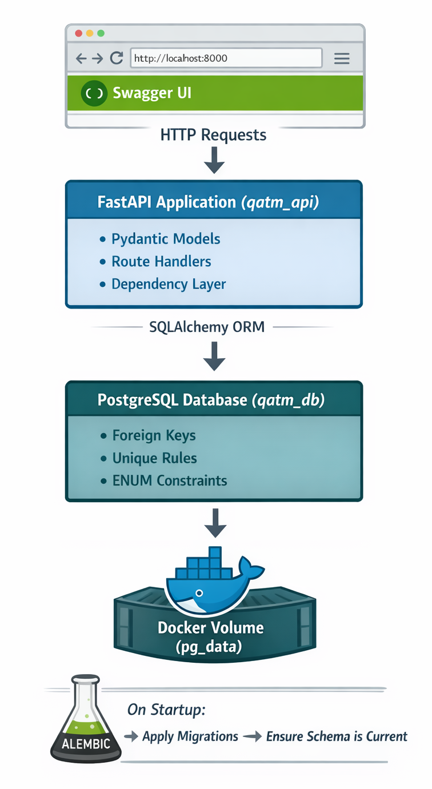
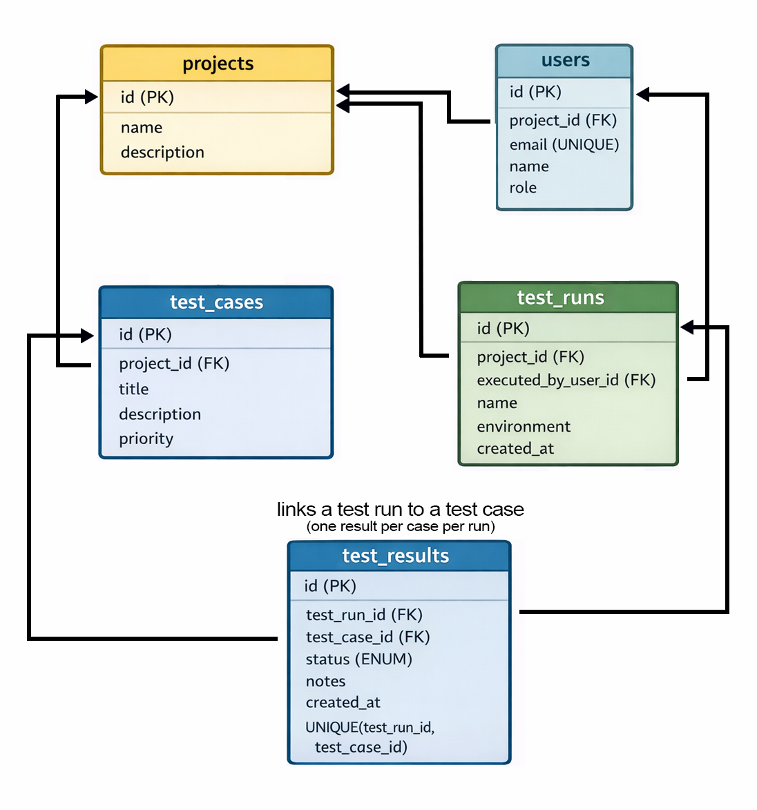

# Mason Garza - QA Test Management API 

## Overview 
This project demonstrates relational database design and API integration through a Quality Assurance test management backend system with FastAPI and PostgreSQL. It emphasizes foreign key relationships, data integrity constraints, ENUM enforcement, and reporting-style queries that mirror real-world testing workflows and QA dashboards. The system includes schema migrations with Alembic, environment-based configuration, and Docker Compose to create a reproducible, production-aware local environment. It can run both locally and in containers using the same configuration pattern. The API is fully documented through Swagger for interactive exploration. The goal is to showcase practical SQL-backed application architecture beyond simple CRUD examples.

This project is designed as a portfolio-quality demonstration of:
- Relational data modeling (foreign keys, constraints, normalization)
- SQL/ORM-backed reporting (coverage, pass rate, history)
- Schema migrations with Alembic
- Containerized local development with Docker Compose
- API documentation via Swagger/OpenAPI (FastAPI `/docs`)

---

## Tech Stack

- **FastAPI** — REST API framework
- **Uvicorn** — ASGI server that runs FastAPI
- **PostgreSQL** — relational database
- **SQLAlchemy** — ORM (maps Python models to tables)
- **Alembic** — database schema migrations
- **Pydantic** — request/response validation
- **Docker + Docker Compose** — reproducible local environment (API + DB)

---

## Data Model (High Level)

Core entities:
- **Projects** contain **Test Cases**.
- **Users** belong to a **Project**.
- **Test Runs** belong to a **Project** and are executed by a **User**.
- **Test Results** connect **Test Runs** to **Test Cases** (one result per case per run).

Key integrity rules:
- `test_results` enforces **one result per (test_run_id, test_case_id)** via a unique constraint.
- `test_results.status` is enforced as a **PostgreSQL ENUM**: `pass | fail | blocked | skipped`.

### System Architecture


### Database Relationships


---

## API Docs (Swagger)

When running the API, open:

- **Swagger UI:** `http://127.0.0.1:8000/docs`
- **OpenAPI JSON:** `http://127.0.0.1:8000/openapi.json`

---

## Run with Docker (Recommended)
### 1. Start services
From the project root:

```bash
docker compose up --build
```
This starts:
- `db` (PostgreSQL)
- `api` (FastAPI)

On startup, the API automatically runs:
```bash
alembic upgrade head
```

### 2. Seed demo data (optional)
In a second terminal:
```bash
docker compose exec api python -m scripts.seed_data
```

### 3. Open Swagger
`http://127.0.0.1:8000/docs`


## Run Locally (Without Docker)
### 1. Create `.env`
In PowerShell, copy the example and update values by running: 
```bash
copy .env.example .env
```
Update `DATABASE_URL` in `.env` to match your local PostgreSQL credentials.

### 2. Install dependencies (venv)
```bash
py -m venv .venv
.\.venv\Scripts\Activate.ps1
pip install -r requirements.txt
```

### 3. Run migrations 
```bash
alembic upgrade head
```

### 4. Start the API
```bash
uvicorn app.main:app --reload
```

Swagger:  
`http://127.0.0.1:8000/docs`

### 5. Seed demo data (optional)
```bash
python -m scripts.seed_data
```


## Resetting the Database (Docker)
Reset containers but keep data:
```bash 
docker compose down
docker compose up
```

Wipe all DB data and start fresh:
```bash
docker compose down -v
docker compose up --build
```

Then re-seed:
```bash
docker compose exec api python -m scripts.seed_data
```

## Reporting Endpoints

This project includes “reporting style” endpoints that reflect real QA dashboards:
- **Test run report**: pass rate, executed count, status totals
- **Coverage report**: executed vs not run for a given run
- **Test case history**: show how a test case performed across multiple runs

Use Swagger to explore available endpoints and example payloads.

## Notes
### SQL logging
SQL output is controlled via the SQL_ECHO environment variable:
- SQL_ECHO=false (default)
- SQL_ECHO=true to print SQL statements

## Next steps
- Automated tests (pytest + FastAPI TestClient)
- Simple API key auth for protected endpoints
- Analytics endpoints (per-project trends, most failing cases, etc.)
- CI pipeline (GitHub Actions) to run tests 